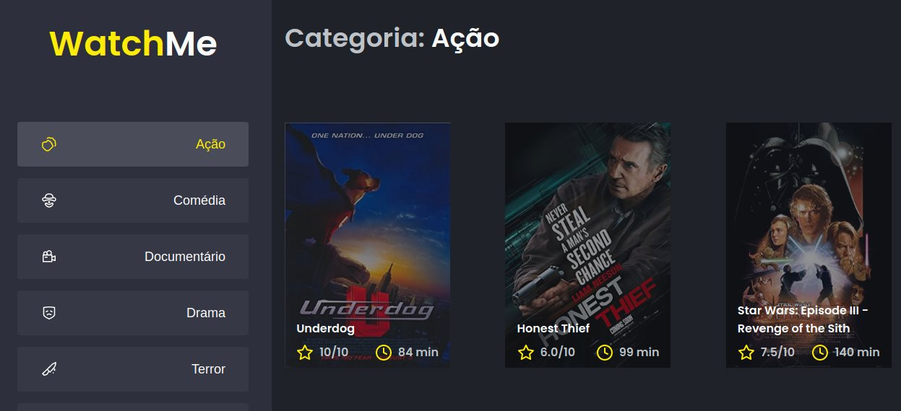
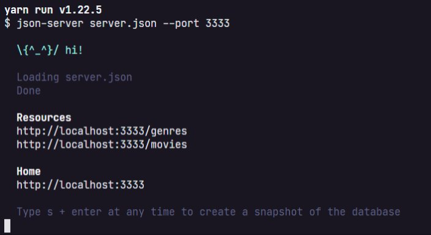

<p align="center">
  
</p>

<p align="center">
  <a href="#-tecnologias">Tecnologias</a>&nbsp;&nbsp;&nbsp;|&nbsp;&nbsp;&nbsp;
  <a href="#-projeto">Projeto</a>&nbsp;&nbsp;&nbsp;|&nbsp;&nbsp;&nbsp;
  <a href="#memo-licença">Licença</a>
</p>
<br>

<p align="center">
    
</p>

## 🚀 Tecnologias

Esse projeto foi desenvolvido com as seguintes tecnologias:

- Typescript
- Javascript
- SCSS
- HTML

## 💻 Projeto

Refatoração da aplicação tendo como principais componentes: Sidebar, Header e Content. 

- A aplicação possui apenas uma funcionalidade principal que é a listagem de filmes;
- Na sidebar é possível selecionar qual categoria de filmes deve ser listada;
- A primeira categoria da lista (que é "Ação") já começa como marcada;
- O header da aplicação possui apenas o nome da categoria selecionada que muda dinamicamente.

### Fake API com JSON Server

Na aplicação é utilizado o JSON Server para simular uma API que possui as informações de gêneros e filmes. 

Navegue até a pasta criada, abra no Visual Studio Code e execute os seguintes comandos no terminal:

```bash
yarn
yarn server
```

Em seguida, você vai ver a mensagem:



Perceba que ele iniciou uma fake API com os recursos /genres e /movies em localhost na porta 3333 a partir das informações do arquivo server.json localizado na raiz do seu projeto. Acessando essas rotas no seu navegador, você consegue ver o retorno das informações já em JSON.

E para rodar aplicação é só executar o comando no terminal:

```bash
yarn dev
```

## :memo: Licença

Esse projeto está sob a licença MIT. Veja o arquivo [LICENSE](LICENSE.md) para mais detalhes.
